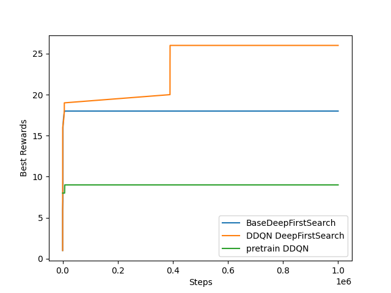

# RL-Graph-Matching

## 1 Introduction

A framework for large graph matching based on reinforcement learning. We used Double Deep Q-learning algorithm (DDQN) based on Graph Attention Network(GAT https://arxiv.org/abs/1710.10903) with Deep First  Search method (DFS) to solve this problem, and tested on a target network of 200 nodes and subgraph of 40 nodes. Results of GAT-based DFS-DDQN is better than results of simple DFS and pure reinforcement learning method within 1e6 steps.

## 2 Project Structure

```
|----agent
		|----nets
				|----GAT.py
				|----GraphConv.py
		|----BaseDFS.py
		|----DDQN.py
		|----DFS_DDQN.py
|----data
		|----source.npy
		|----target.npy
|----env
		|----graph_matching_env.py
|----results
		|----model results
		|----test results
|----utils
		|----utils.py
		|----visualize.py
|----LICENSE
|----README.md
|----run_test.sh
|----setup.yaml
|----train_and_test.py
```

## 3 Quick Start

We recommend using conda to create virtual environment. Please ensure your **CUDA** version is compatible with **pytorch geometric**, see https://pytorch-geometric.readthedocs.io/en/latest/notes/installation.html.

```sh
conda env create -f setup.yaml
conda activate geometric
```

We use pre-trained  DDQN model to run DDQN-DFS algorithm. To do pre-training, run:

```sh
python train_and_test.py --test False --agent "DDQN" --batch_size 500 --sample_size 2000 --maxsteps=10000
```

To test four methods, you can run *run_test.sh* if you use Linux:

```sh
sh run_test.sh
```

For windows, you can directly run:

```sh
python train_and_test.py --test True --agent "DFS"
python train_and_test.py --test True --agent "DDQN_DFS"
python train_and_test.py --tau 0.995 --test True --agent "DDQN" --batch_size 64 --sample_size 0 --replay_size 1000 --maxsteps=1000000
python train_and_test.py --tau 0.995 --test True --agent "pretrain_DDQN" --batch_size 64 --sample_size 0 --replay_size 1000 --maxsteps=1000000
```

To plot and compare results, run:

```sh
python visualize.py
```

## 4 Result

Results shows that DFS-DDQN method can match 26 nodes within 1e6 steps.


